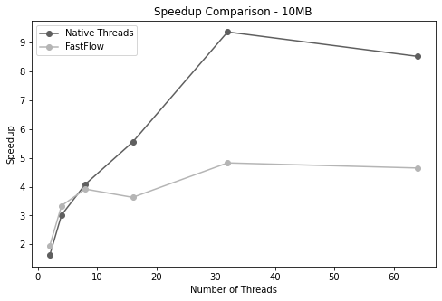
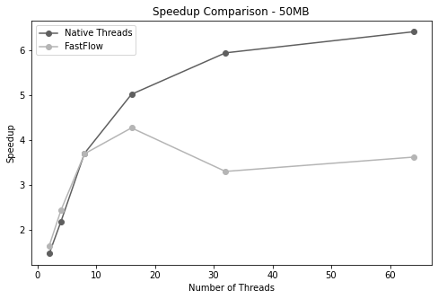
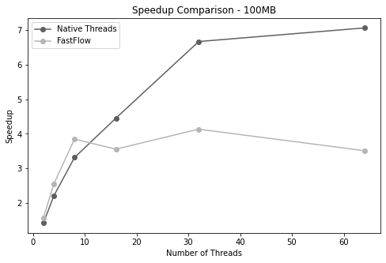
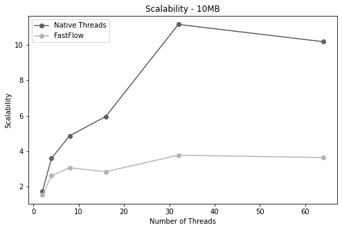
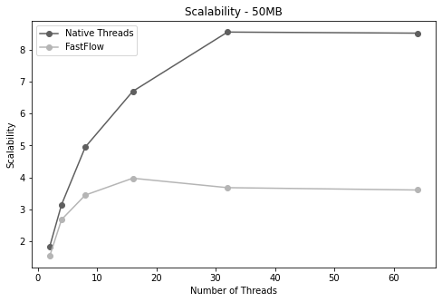
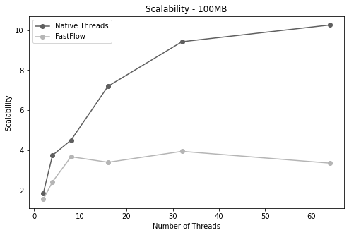

# Parallel Huffman Coding

## Report
This report presents a parallel ASCII file compression algorithm utilizing the [Huffman Coding Algorithm](https://en.wikipedia.org/wiki/Huffman_coding). The algorithm exploits the concurrency of contemporary multicore processors to enhance the performance of the traditional algorithm. The primary contributions of this work are as follows:

- A **parallel** implementation of the Huffman Coding Algorithm, employing C++ native threads, which are low-level primitives for creating and managing threads.
- A **parallel** implementation of the Huffman Coding Algorithm, utilizing the **[FastFlow](https://github.com/fastflow/fastflow) C++ library**, which facilitates the development of parallel applications, modeled as structured directed graphs of processing nodes, on multicore platforms.
- A **sequential** implementation of the Huffman Coding Algorithm, serving as a baseline for comparison.
- A series of experiments, written in Python Notebooks, to measure the performance of the three implementations, using varying input sizes and numbers of threads. The results are reported in terms of **execution time**, **speedup**, and **scalability**.
- The implementations of the algorithm.
- Integration tests to verify the correctness of the parallel solutions.

## Algorithm phases
After conducting an analysis, the following steps were identified as necessary to compress files using the Huffman Coding algorithm:

1. **File read**: The file to be compressed is read.
2. **Counting characters**: The frequency of each character in the file is counted.
3. **Build the Huffman tree**: A Huffman tree is built based on the character frequencies.
4. **Build the encoding table**: An encoding table is created, which maps each character to its respective Huffman code taken from the Huffman tree.
5. **Encoding phase**: The ASCII file is encoded using the encoding table.
6. **Compression phas**e: The compressed string is grouped into `bitset<8>` to actually compress the file.
7. **Write the compressed file**.

## Performance tests
Since the goal of this project was to identify areas for improvement in the sequential solution 
using parallel computing techniques, I measured the execution time of each stage in the sequential
solution, enabling the identification of potential candidates for refactoring and enhancement using multithreading. Additionally, I performed performance tests (executed by a machine using a dual socket, 16 cores each, 2 way hyper threading **AMD EPYC 7301**) with both the parallel implementations (native threads, and **[FastFlow](https://github.com/fastflow/fastflow)** C++ library). 

### Stages performance
I decided to first benchmark how much each stages takes in the entire process of compression and here's what emerged by measuring the time taken from each stage (excluding the read/write and the actual compression) sequentially with three different file sizes which are `s=10MB`, `m=50MB`, and `l=100MB`:

| stages performance (%) | counting | huffman tree | encoding |
| ---------------------- | -------- | ------------ | -------- |
| s                      | 57.04    | 0.80         | 42.16    |
| m                      | 57.53    | 0.92         | 41.55    |
| l                      | 57.00    | 0.98         | 42.02    |

The reason why the Huffman tree phase is much quicker is because the tree has an upper bound equals to 256 which is the dimension of the ASCII table. Since the binary tree is filled with all the characters and symbolic nodes, to traverse the tree one pays only `O(1)`. A map was used to store for each character its Huffman encoding, in that way each time one wants to get in the encoding phase the code referred to that character it will be done in `O(1)`. The other stages are “expensive” because one has to count the characters in `O(n)` and encode the characters still in `O(n)`.


### Speedup and scalability tests
Recalling that *speedup* is a measure of the improvement in execution time achieved through parallelization and that `speedup(n) = Tseq / Tpar(n)` and *scalability* measures the ability of the system to maintain or improve its performance as the problem size or the number of processing units is scaled up `scalability(n) = Tpar(1) / Tpar(n)`. In the following table there is the speedup table, considering that the sequential time on average `Tseq(s) = 724828`, `Tseq(m) = 3310951` and `Tseq(l) = 6382589`. 

| **speedup 10MB**   | **2 threads** | **4 threads** | **8 threads** | **16 threads** | **32 threads** | **64 threads** |
| ------------------ | ------------: | ------------: | ------------: | -------------: | -------------: | -------------: |
| **native threads** |         1.617 |         3.017 |         4.082 |          5.550 |          9.373 |          8.527 |
| **fastflow**       |         1.946 |         3.340 |         3.917 |          3.629 |          4.827 |          4.649 |



| **speedup 50MB**   | **2 threads** | **4 threads** | **8 threads** | **16 threads** | **32 threads** | **64 threads** |
| ------------------ | ------------: | ------------: | ------------: | -------------: | -------------: | -------------: |
| **native threads** |         1.462 |         2.179 |         3.696 |          5.012 |          5.935 |          6.405 |
| **fastflow**       |         1.638 |         2.431 |         3.686 |          4.263 |          3.293 |          3.612 |



| **speedup 100MB**  | **2 threads** | **4 threads** | **8 threads** | **16 threads** | **32 threads** | **64 threads** |
| ------------------ | ------------: | ------------: | ------------: | -------------: | -------------: | -------------: |
| **native threads** |         1.419 |         2.201 |         3.314 |          4.454 |          6.670 |          7.064 |
| **fastflow**       |         1.567 |         2.543 |         3.848 |          3.558 |          4.135 |          3.513 |



| **scalability 10MB** | **2 threads** | **4 threads** | **8 threads** | **16 threads** | **32 threads** | **64 threads** |
| -------------------- | ------------: | ------------: | ------------: | -------------: | -------------: | -------------: |
| **native threads**   |         1.730 |         3.596 |         4.868 |          5.962 |         11.152 |         10.177 |
| **fastflow**         |         1.524 |         2,618 |         3,067 |          2,844 |          3,774 |          3,642 |



| **scalability 50MB** | **2 threads** | **4 threads** | **8 threads** | **16 threads** | **32 threads** | **64 threads** |
| -------------------- | ------------: | ------------: | ------------: | -------------: | -------------: | -------------: |
| **native threads**   |         1.829 |         3.147 |         4.951 |          6.697 |          8.557 |          8.523 |
| **fastflow**         |         1,532 |         2,678 |         3,446 |          3,975 |          3,679 |          3,606 |



| **scalability 100MB** | **2 threads** | **4 threads** | **8 threads** | **16 threads** | **32 threads** | **64 threads** |
| --------------------- | ------------: | ------------: | ------------: | -------------: | -------------: | -------------: |
| **native threads**    |         1.842 |         3.751 |         4.502 |          7.195 |          9.417 |         10.254 |
| **fastflow**          |         1,552 |         2,427 |         3,678 |          3,400 |          3,947 |          3,357 |



### How to run it

To create a random 10MB ascii file, just run:
`base64 /dev/urandom | head -c 10000000 > 10M`

in the inputs file"
```bash
total 153M
-rw-rw-r-- 1 m.marino38 m.marino38 96M Jul  5 19:09 100MB
-rw-rw-r-- 1 m.marino38 m.marino38 10M Jul  5 19:04 10M
-rw-rw-r-- 1 m.marino38 m.marino38 48M Jul  5 19:09 50M
```

To execute the native threads solution using 2 as parallelisation's degree on a 10MB file:
`./output n 1 2 ./inputs/10M`
